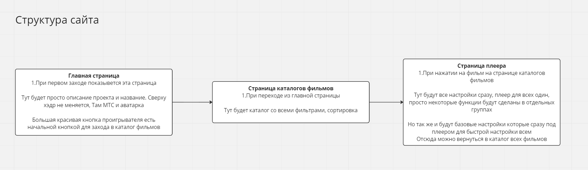
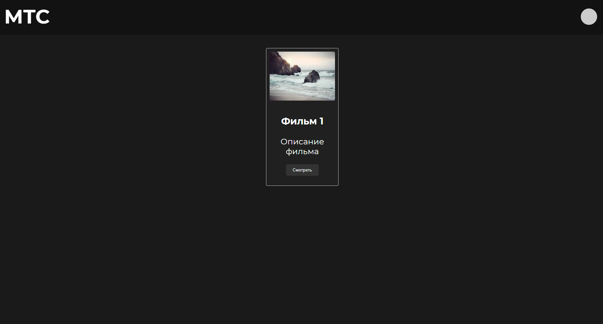
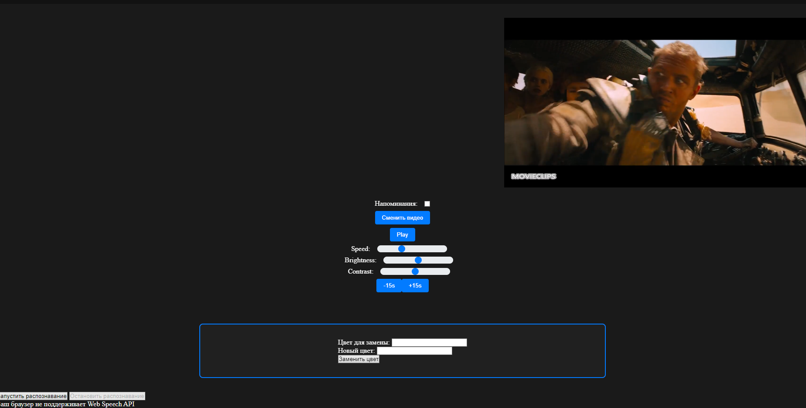
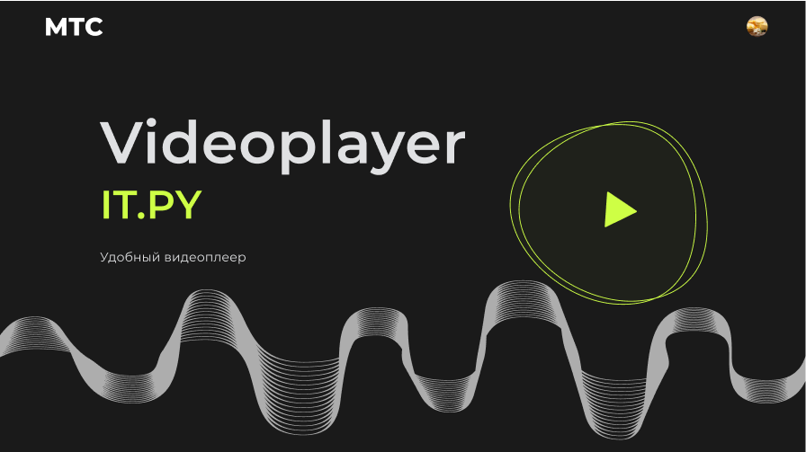
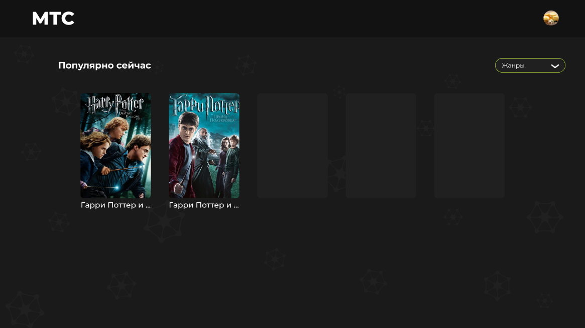
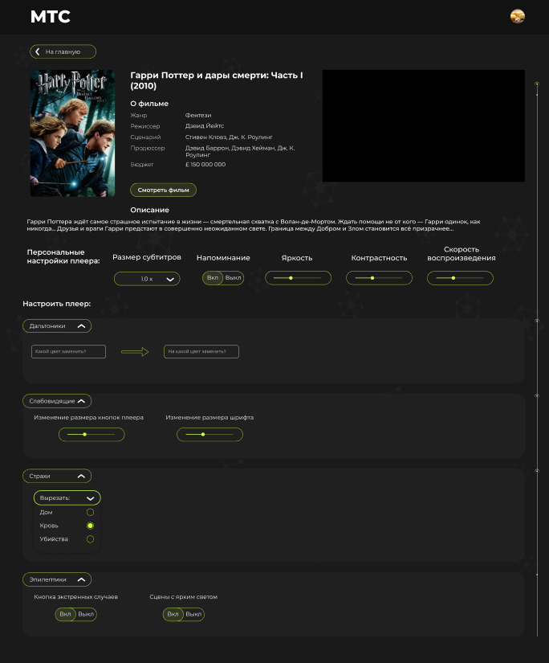
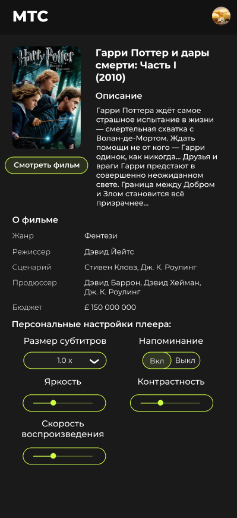
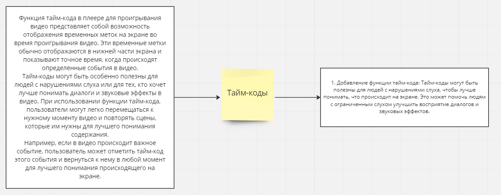

1) Инструкции по развертке и установки решения 
   1. Скачиваем репозиторий(клнориуем или распоковываем .zip со всеми файлами)
   2. Для сайта-прототипа: открываем MainWindow.html и кнопками переключаемся между окнами, для возвращения на глвную нажать надо на "МТС"
   3. Для сайта с упарвлением через голос: открываем папку Распознование речи(управление) и открываем файл Speek.html
   4. Для испытания моедли по анализу цветов: Переходим в папку Анализ цветов, дальше запускаем Analys.py
   5. Для испытания модели по блюру сцен по написанному объекту в консоле: Переходим в папку Анализ сцен (блюр), дальше запускаем main.py
   6. Для испытания модели по добавлению субтитров на видео: переходим в папку Субтитры, дальше запускаем SUB.py

2) Визуальное описание бизнес-процесса, сервисов (описание идей и предложеных решений)
    1. Код со всеми функциями и всеми фичами которые происходят на PlayerWindow.html написаны в PlayerWindow.js:
       * В данном коде реализованы следующие функции:
       * Получение объектов элементов страницы, таких как видео, кнопки управления видео, слайдеры яркости, контрастности и скорости, а также других элементов страницы.
       * Установка обработчиков событий на различные элементы страницы, такие как кнопки управления видео и чекбокс напоминаний.
       * Изменение параметров видео, таких как скорость, яркость и контрастность, в зависимости от значений на слайдерах.
       * Обработка событий перемотки видео на 15 секунд назад или вперед.
       * Реализация функции сохранения времени, на котором остановился пользователь, в localStorage при закрытии страницы и установка этого времени в качестве времени начала видео при следующем открытии страницы.
       * Реализация функции переключения видео на другой файл и запуска его проигрывания.
       * Реализация функции распознавания речи, которая позволяет пользователю управлять проигрыванием видео с помощью голосовых команд.
       * Реализация функции настройки напоминаний о перерывах в просмотре видео, включающей задание количества напоминаний и интервала между ними, а также запуск напоминаний в соответствии с заданными параметрами.
    2. Код в Speek.js:
   
       Данный код на JavaScript создает функциональность распознавания голосовых команд с помощью Web Speech API. Сначала получаются объекты элементов страницы: видео, кнопки запуска и остановки распознавания речи, а также элементы для вывода статуса и ошибок. Затем проверяется поддержка Web Speech API браузером. Если она поддерживается, создается объект распознавания речи и настраиваются его параметры, такие как язык и режимы работы. Затем обработчики событий устанавливаются на начало и конец распознавания речи, а также на обработку результатов распознавания и ошибок. Кнопки запуска и остановки распознавания также получают обработчики событий, чтобы пользователь мог запустить и остановить распознавание по своему желанию. В обработчиках событий проверяются результаты распознавания речи и выполняются соответствующие действия: остановка или возобновление видео. Если при распознавании возникает ошибка, выводится соответствующее сообщение.
    3. Код в Analys.py:
   
       Данный код использует библиотеку OpenCV для чтения видеофайла и расчета процентного соотношения красного, зеленого и синего цветов в каждом кадре видео. Результаты записываются в файл 'colors.txt'. Затем текущий кадр отображается в окне с названием 'frame'. Цикл продолжается, пока не будет нажата клавиша 'q' или не закончится видео. После этого память очищается и окна закрываются.
    4. Код в main.py:
   
       Этот код отвечает за обнаружение объектов на видео при помощи алгоритма YOLO (You Only Look Once). В функции apply_yolo_object_detection происходит подготовка изображения к обработке и запуск нейронной сети YOLO для обнаружения объектов. Затем происходит отбор объектов, которые необходимо обнаружить на видео, и их отображение на изображении при помощи функции draw_object_bounding_box. Функция draw_object_count отвечает за вывод количества обнаруженных объектов на экране. В функции start_video_object_detection происходит запуск видеофайла и отображение каждого кадра с обнаруженными объектами на экране. В коде используются библиотеки OpenCV, numpy и art.
    5. Код в SUB.py:
   
       В данном коде происходит добавление субтитров на видео с помощью библиотеки moviepy.
       Сначала загружается видео и субтитры с помощью функций VideoFileClip и SubtitlesClip соответственно. Затем задаются параметры для субтитров: цвет (переменная userColor) и размер шрифта (переменная userFontsize).
       Далее устанавливается длительность субтитров и их положение (в данном случае снизу по центру). Затем происходит композиция видео и субтитров с помощью функции CompositeVideoClip.
       Наконец, полученное видео сохраняется с помощью функции write_videofile.

3) Схематическое описание архитектуры

На скриншоте показана структура сайта.

4) Скриншоты сервиса

Как будет выглядеть в будущем:

Для телефона (на будущее):

6) Предложения по масштабированию
   Добавление следующих функций:

      *Добавление тайм-кодов

      * Регуляция распределенного звука
      * Управление хлопками
      * “Затухание сцены” (относится к скримерам и тп)